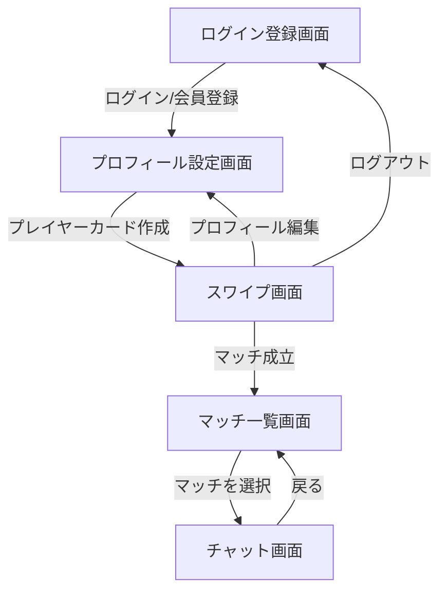
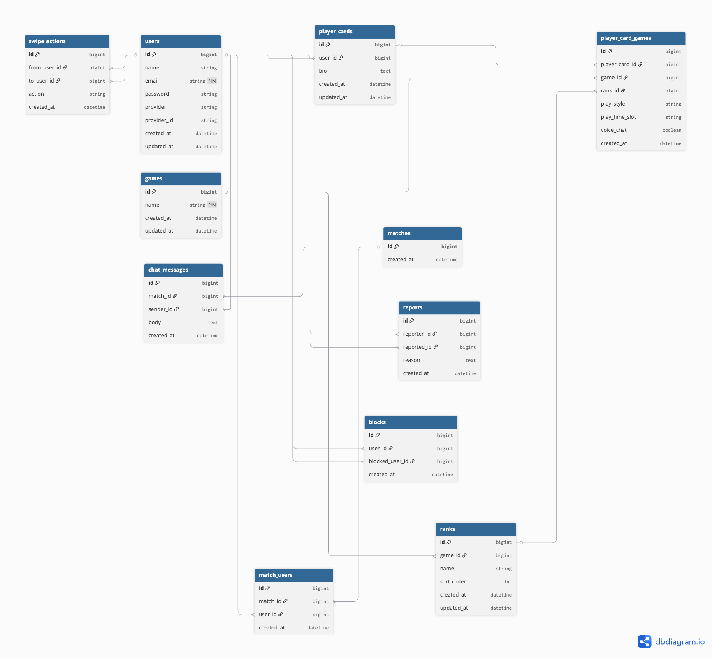

# PlayWith(プレイウィズ)

## サービス概要

PlayWith(プレイウィズ)は、一緒にゲームをプレイする仲間をスワイプ形式でマッチングできるWebアプリです。

プレイ中のゲームタイトルやプレイスタイル、ランク帯、プレイ時間帯などを登録したプレイヤーカードを見て、気になる相手にスワイプ。お互いに「参加したい」と意思表示すればマッチが成立し、リアルタイムチャットでゲームの約束ができます。

---

## 開発背景

ゲームマッチングアプリ「PlayWith(プレイウィズ)」は、「ゲームを通じて新しい繋がりと楽しさを提供する」という理念のもとで開発されました。

ゲームは一人でも楽しめますが、「一緒に遊ぶ仲間がいない」「募集を出しても反応がもらえない」という悩みを抱えるプレイヤーは多くいます。既存のゲーム仲間募集サービスは掲示板形式が中心で、相手を選ぶ手間や返信の心理的ハードルが高いという課題がありました。

そこでPlayWithは、プレイヤーが「ランク帯」や「プレイスタイル」などの条件を指定し、スワイプ操作で気軽に相手を選び、相互の意思確認が取れた場合のみつながる仕組みを採用。心理的ハードルを下げながら、今すぐ一緒に遊べる安心・安全な仲間を見つけられる環境づくりを目指してリリースされました。

---

## ユーザー層

- 一緒にプレイする仲間が欲しいゲームプレイヤー
- ランクやプレイスタイルが合う相手を探したいFPS/対戦ゲームプレイヤー
- ボイスチャットの有無など、相手との相性を事前に確認したい人
- 決まった時間帯にゲームをプレイする仲間を見つけたい人

---

## サービスの利用イメージ

1. ユーザー登録・ログイン(メール/パスワード or Googleログイン)
2. プレイヤーカードを作成(プレイ中のゲームタイトル、プレイスタイル、ボイスチャット有無、ランク帯、プレイ時間帯を設定)
3. カードスワイプ画面で他のプレイヤーを閲覧し、気になる相手に「参加したい」でスワイプ
4. お互いにスワイプが一致するとマッチ成立、リアルタイム通知が届く
5. マッチ一覧からチャット画面へ移動し、リアルタイムでやり取りしてゲームの約束をする
6. 迷惑なユーザーは通報・ブロックが可能

---

## 機能一覧

### MVP

- **認証機能**(Laravel Sanctum)
  - メール/パスワード認証
  - Googleログイン(Socialite)
- **プレイヤーカード機能**
  - プレイ中のゲームタイトル・プレイスタイル・ボイスチャット有無の登録
  - 主要タイトル(APEX、Valorantなど)のランク帯・プレイ時間帯の登録(マスタデータから選択)
- **スワイプマッチング機能**
  - カードのスワイプ(参加したい/スキップ)
  - 相互スワイプでのマッチ成立
- **リアルタイムチャット機能**(Laravel Reverb)
  - マッチ成立ユーザー同士のメッセージ送受信
- **安全機能**
  - ユーザーの通報
  - ユーザーのブロック(ブロック済みユーザーはスワイプ対象から除外)

### 本リリース予定

- 対応ゲームタイトルの拡充
- プロフィール画像・実績バッジ表示
- マッチング精度向上(プレイ時間帯・ランク帯によるおすすめ表示)
- 通知機能(プッシュ通知)
- 運営による通報対応・アカウント制限フロー
- 募集一覧機能(スワイプの代替ではなく、即時性を求めるユーザー向けの補助機能)
- 今すぐ募集機能(募集一覧の中でも、その場ですぐ一緒に遊べる相手を探す機能)

---

## 使用技術スタック

| カテゴリ | 技術 |
|---|---|
| バックエンド | Laravel(APIモード) |
| フロントエンド | Next.js(App Router)/ TypeScript |
| 認証 | Laravel Sanctum + Socialite(Google) |
| リアルタイム通信 | Laravel Reverb(WebSocket) |
| データベース | PostgreSQL |
| 開発環境 | Docker(バックエンド・フロントエンドを別コンテナで管理) |

---

## 技術選定理由

| 技術 | 選定理由 |
|---|---|
| Laravel(APIモード) | 他言語のフレームワークと比較し、認証・キュー・WebSocketなど必要な機能が標準で揃っている点や、公式ドキュメントや利用者が多く情報を探しやすい点を評価して選定 |
| Next.js / TypeScript | スワイプ操作など対話的なUIに適したSPA構成。型安全に開発できる |
| Laravel Sanctum | SPA向けのcookieベース認証を数行で実装でき、トークン管理の手間が少ない |
| Laravel Reverb | Laravel公式のWebSocketサーバーで、マッチ通知・チャットのリアルタイム性を実現 |
| PostgreSQL | Laravelとの相性が良く、将来的な拡張(全文検索など)にも対応しやすい |
| Docker(バックエンド/フロントエンド分離) | 環境差異をなくしつつ、フロントとバックを独立して開発・デプロイできる構成にするため |

---

## サービスの差別化ポイント

### 1. 相互スワイプによる心理的ハードルの低さ

掲示板形式の募集と違い、お互いが「参加したい」と意思表示した場合のみつながるため、一方的な連絡への不安がありません。

### 2. ゲームごとのランク・プレイスタイルを踏まえたマッチング

主要タイトルのランク帯やプレイ時間帯を登録できるため、実力やプレイスタイルが近い相手を見つけやすくなっています。

### 3. マッチ後はリアルタイムチャットですぐに約束

マッチ成立後はリアルタイムチャットでそのままやり取りができ、スムーズにゲームの予定を立てられます。

### 4. 通報・ブロック機能をMVPから搭載

マッチングアプリとして最低限の安全性を確保するため、通報・ブロック機能を初期段階から実装しています。

---

## 画面遷移図

> 詳細な画面設計は今後Figma等で作成予定です。

---

## ER図

### テーブルの詳細

| テーブル | 役割 | 主なカラム |
|---|---|---|
| users | ユーザーアカウント情報 | name: 表示名 / email: ログインID / password: ハッシュ化パスワード(メール登録時) / provider, provider_id: Googleログイン時の連携先・ID |
| games | 対応ゲームタイトルのマスタ | name: ゲームタイトル(APEX、Valorantなど) |
| ranks | ゲームごとのランク帯マスタ | game_id: 対象ゲーム / name: ランク名 / sort_order: 表示順 |
| player_cards | ユーザーが作成するプレイヤーカード本体 | user_id: 作成者 / bio: 自己紹介文 |
| player_card_games | プレイヤーカードと対応ゲームの中間テーブル(1カードで複数ゲーム登録可能) | player_card_id, game_id: カードとゲームの紐付け / rank_id: そのゲームでのランク帯 / play_style: プレイスタイル(ガチ勢/エンジョイ勢など) / play_time_slot: プレイ時間帯(平日夜など) / voice_chat: ボイスチャット可否 |
| swipe_actions | スワイプ画面での操作履歴 | from_user_id: スワイプした人 / to_user_id: スワイプされた人 / action: like(参加したい)/skip(スキップ) |
| matches | マッチ成立の単位を表すレコード | created_at: マッチ成立日時 |
| match_users | マッチと当事者ユーザーの中間テーブル | match_id: 対象マッチ / user_id: マッチ成立した当事者 |
| chat_messages | マッチ後のチャットメッセージ | match_id: 紐づくマッチ / sender_id: 送信者 / body: メッセージ本文 |
| reports | 通報履歴 | reporter_id: 通報した人 / reported_id: 通報された人 / reason: 通報理由 |
| blocks | ブロック関係 | user_id: ブロックした人 / blocked_user_id: ブロックされた人(ブロック済みユーザーはスワイプ対象から除外) |
